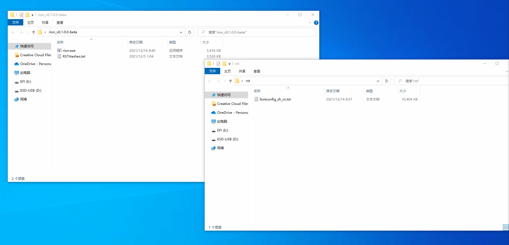

# 📖 rion

[中文](README_CN.MD) | English

***rion*** is an RST file conversion tool that allows you to convert RST files to Json files.

In addition, the converted Json file can be converted back to RST to realize the conversion between RST and Json file.

**💡 You can convert the RST file to Json format by editing the content of the Json file and then converting the Json file to RST format to achieve the effect of modifying the RST file.**



# ⚙ Command line arguments
```
Usage: rion [options]
Usage: rion [input-file-path] [output-file-path]

Options:
  -e|--equals   Check whether the files are the same.
  -h|--help     Display help.
  -v|--version  Display version.

input-file-path:
  The file path to input.
output-file-path:
  The path to the output file.
```

# 🚀 Sample

```
/* Convert a single file */
rion fontconfig_zh_cn.txt
```

```
/* Convert multiple files */
rion fontconfig_zh_cn.txt fontconfig_zh_my.json fontconfig_en_us.txt fontconfig...
```

```
/* Compare files */
// Use the -e option to enter two files for comparison
rion -e fontconfig_zh_cn.txt fontconfig_en_us.txt
```

**You can also drag and drop files into rion to open them, which will convert them directly.**

# 🔖 Other

The program code supports cross-platform and does not need to be modified.

If you need to run on another platform, please compile it yourself.

*Pre-release 0.1.0.0 uses AOT compilation*
